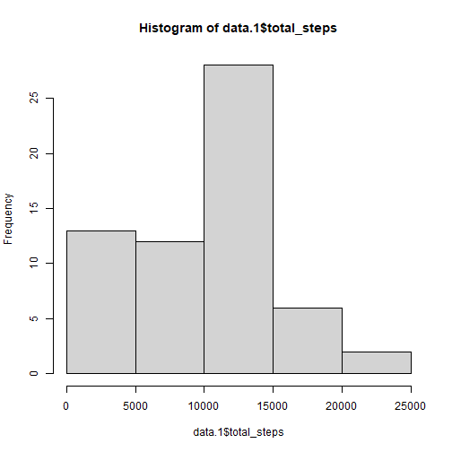
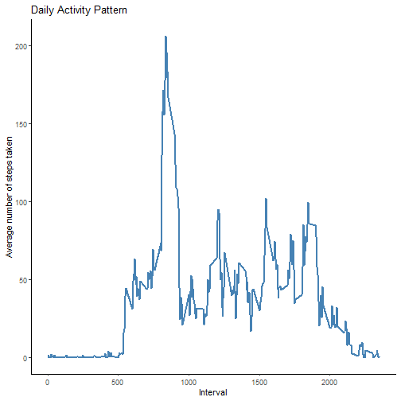
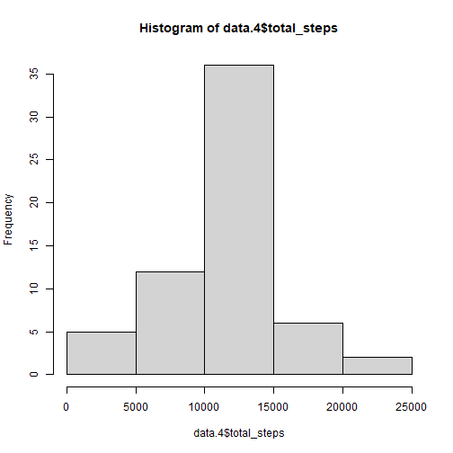
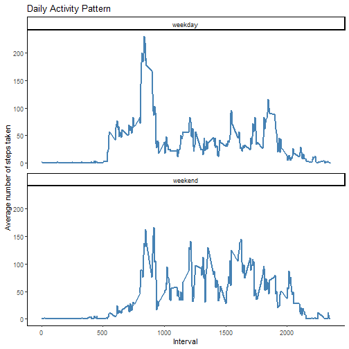

## Loading and preprocessing the data
First, load the data. 

``` r
unzip("activity.zip")
data <- read.csv("activity.csv")
```

Second, change "date" from character vector to Date vector using lubridate package. 

``` r
library(lubridate) 
data$date <- ymd(data$date)
```

## What is mean total number of steps taken per day? 
Here is the histogram of total number of steps taken each day. 

``` r
library(dplyr)
data.1 <- data %>% 
        group_by(date) %>% 
        summarize(total_steps = sum(steps, na.rm=TRUE), .groups="drop")
```

``` r
hist(data.1$total_steps) # histogram of total number of steps taken each day 
```


  
Now let's calculate the mean and median of steps taken per day. 

``` r
mean(data.1$total_steps) 
```

[1] 9354.23

``` r
median(data.1$total_steps)
```

[1] 10395


## What is the average daily activity pattern? 
Make a time series plot of the 5-minute interval (x-axis) and the average number of steps taken, averaged across all days (y-axis). 

``` r
data.2 <- data %>% 
        group_by(interval) %>%
        summarize(average_steps = mean(steps, na.rm=TRUE), .groups="drop")

library(ggplot2)
plot1 <- ggplot(data.2, aes(x=interval, y=average_steps)) +
        geom_line(color="steelblue", lwd=1) + 
        labs(title = "Daily Activity Pattern", 
             x = "Interval", 
             y = "Average number of steps taken") + 
        theme_classic()

plot1
```


  
Which 5-minute interval contains the maximum number of steps?

``` r
data.2$interval[which.max(data.2$average_steps)]
```

[1] 835
  
**835 interval contains the maximum number of steps, as shown in the graph above.**

## Imputing missing values 

Calculate and report the total number of missing values int the dataset.

``` r
sum(is.na(data))
```

[1] 2304
To fill in the missing values, I used the mean for that 5-minute interval.

``` r
data.3 <- data %>% 
        left_join(data.2, by="interval") %>% 
        mutate(steps = ifelse(is.na(steps), average_steps, steps)) %>% 
        select(-average_steps)
```
"data.3" is the new dataframe that is equal to the original dataset but with the missing data filled in. 

Now, create a histogram of the total number of steps taken each day. 

``` r
data.4 <- data.3 %>% 
        group_by(date) %>% 
        summarize(total_steps = sum(steps, na.rm=TRUE), .groups="drop")
hist(data.4$total_steps)
```


  
Let's also calculate the mean and median of steps taken per day. 

``` r
mean(data.4$total_steps) 
```

[1] 10766.19

``` r
median(data.4$total_steps)
```

[1] 10766.19
  
**It differs from the estimates before imputing missing values!**

## Are there differences in activity patterns between weekdays and weekends? 
Create a new factor variable in the dataset with two levels -- "weekday" and "weekend" indicating whether a given date is a weekday or weekend day.

``` r
Sys.setlocale("LC_TIME", "C")
```

[1] "C"

``` r
weekdays = c("Monday", "Tuesday", "Wednesday", "Thursday", "Friday")
weekends = c("Saturday", "Sunday")
data.5 <- data.3 %>%
        mutate(days = ifelse(weekdays(date)%in%weekdays, "weekday", "weekend"))
```
Make a panel plot containing a time series plot (i.e. type = "l") of the 5-minute interval (x-axis) and the average number of steps taken, averaged across all weekday days or weekend days (y-axis).

``` r
data.6 <- data.5 %>% 
        group_by(interval, days) %>%
        summarize(average_steps = mean(steps, na.rm=TRUE), .groups="drop") 

plot2 <- ggplot(data.6, aes(x=interval, y=average_steps)) + 
        geom_line(color="steelblue", lwd=1) + 
        facet_wrap(~ days, ncol = 1)  + 
        labs(title = "Daily Activity Pattern", 
             x = "Interval", 
             y = "Average number of steps taken") + 
        theme_classic() 

plot2
```


